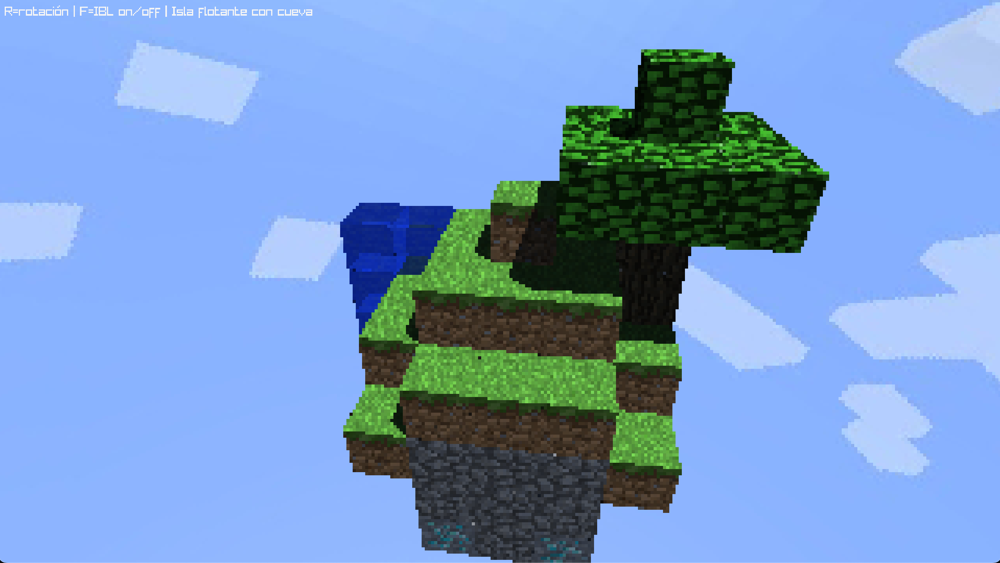
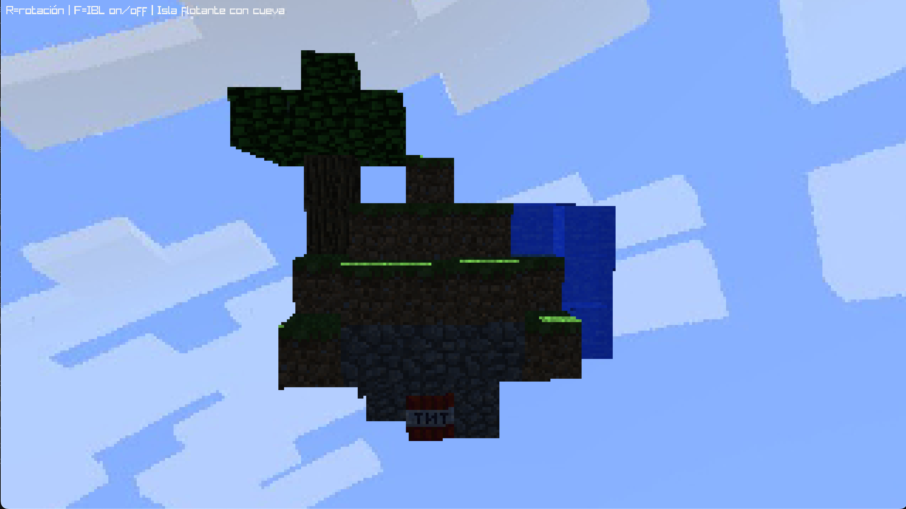

# Raytracer — Floating Voxel Island (Rust + raylib)

> A simple CPU raytracer in Rust that renders a **voxel** diorama (blocks) with **shadows**, **reflection**, **refraction**, **skybox**, **per-face textures**, and an **orbit camera**. The final scene is a **floating island** with a waterfall, a tree, and an **underground cave** featuring TNT and diamonds.




---

## Key Features

- **CPU raytracer** in Rust (no external libraries beyond `raylib-rs`).
- **Textured blocks** (grass with top/side/bottom atlas, dirt, stone, water, wood, leaves, TNT, diamond).
- **Directional lighting** with **hard shadows** (shadow rays).
- **Reflection** (e.g., metal/water) and **refraction** (e.g., glass/water, IOR ~1.33–1.52) with Fresnel blend.
- **Skybox** (equirectangular). Falls back to a gradient if no texture is provided.
- **Orbit camera** with rotation and zoom.
- Modular code layout: `math`, `ray`, `camera`, `material`, `texture`, `shapes`, `scene`, `render`, `skybox`, `lighting`.

---

## Project Structure

```
src/
  camera.rs       # Orbit camera (yaw/pitch/dist/fov)
  lighting.rs     # Directional light, IBL (diffuse from skybox), tiny RNG
  material.rs     # Material (albedo, kd, specular, transparency, reflectivity, ior)
  math.rs         # Vec3 + helpers (reflect, refract, Fresnel)
  ray.rs          # Ray
  render.rs       # Integrator: local shading, shadows, reflection/refraction
  scene.rs        # Object list + light
  shapes/
    cube.rs       # AABB + per-face UVs
    plane.rs      # (optional) infinite plane
    mod.rs
  skybox.rs       # Load/sample equirectangular sky
  texture.rs      # Textures: Image/Checker/BlockAtlas + sample_with_normal()
main.rs           # Scene assembly (island, tree, cave) and main loop
assets/
  sky.jpg
  frontgrass.png  # grass (top)
  grass.png       # grass (side with green border)
  dirt.png        # dirt (bottom)
  stone.png
  water.png
  wood.png
  leaf.png
  diamond.png
  tnt.png
  game1.png       # screenshots for the README
  game2.png
```

---

## Controls

- **← / →**: rotate camera (yaw)  
- **↑ / ↓**: tilt camera (pitch)  
- **R**: toggle auto-rotation of the diorama  
- **Mouse wheel**: zoom in/out  
- **F**: toggle IBL (diffuse light from skybox)

---

## How to Run

### Requirements
- **Rust** (edition 2021)
- **raylib** via the `raylib` crate (no extra setup required on supported platforms)

### Commands
```bash
# Build
cargo build

# Run
cargo run
```

> If `assets/sky.jpg` or any texture is missing, the engine will fall back to a **gradient** or **checker** pattern.

---

## Implementation Notes

- **Materials** (≥5 types) included: wood, stone, dirt/grass (atlas), water, leaves — plus TNT and diamond.
- **Reflection** controlled via `reflectivity`; **Refraction** via `transparency` + `ior`.
- **Shadows**: a single shadow ray per hit with a small bias to avoid acne.
- **Per-face textures** for grass using `Texture::BlockAtlas` and `sample_with_normal(uv, n)`.
- **Skybox** loaded with `Skybox::load("assets/sky.jpg")`, with gradient fallback.

---

## Video

Link to the video 
